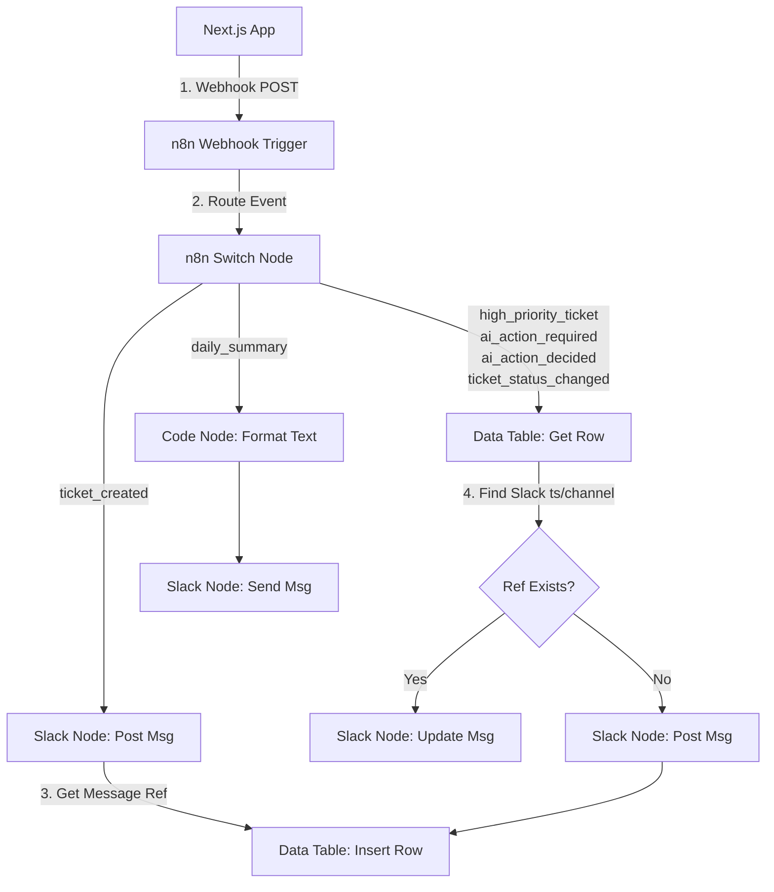

# n8n Integration & Deployment Guide

This document provides a step-by-step walkthrough for configuring and deploying the n8n automation workflow integrated with this AI Support Ticket System. 

Instead of just explaining *what* needs to be configured, this guide explains exactly *how* to build the workflow using modern **n8n v1+** features, including **n8n Data Tables** for state management and native **Slack** node operations.

---

## 1. Integration Architecture

The application communicates with n8n asynchronously. When tickets are created, analyzed by AI, escalated, or updated, Next.js fires outbound webhook payloads. n8n processes these payloads, routes them based on event types, tracks the associated Slack message references using a built-in Data Table, and updates the target Slack thread in real-time.



---

## 2. Application Environment Variables

Set these environment variables on your web application host (e.g., Render, Vercel, Railway):

| Variable Name | Required | Description / Value |
|---|---|---|
| `N8N_WEBHOOK_URL` | Yes (to enable) | The public production URL of your n8n Webhook node. Example: `https://n8n.yourdomain.com/webhook/ticket-events` |
| `N8N_WEBHOOK_SECRET` | Optional | Shared authentication secret for securing inbound calls from n8n back into Next.js. |
| `CRON_SECRET` | Yes (for daily cron) | Secure bearer token to authorize trigger requests to `/api/cron/daily-summary`. |

---

## 3. Step 1: Create the n8n Data Table

To keep Slack workspace clutter to a minimum, this integration posts **one message per ticket** and updates that exact message throughout the ticket's lifecycle. To do this, n8n needs to store the relation between the database `ticketId` and the Slack message reference (`channel` + `ts`).

We use **n8n Data Tables** (a native feature in n8n v1+) to persist this state reliably:

1. Log into your n8n dashboard.
2. In the left-hand navigation menu, click on **Data tables**.
3. Click the **Create table** button in the top right.
4. Name the table: `slack_tickets`.
5. Add the following columns by clicking **+ Add column**:
   - **`ticketId`** (Type: `String`): The unique identifier of the ticket in Next.js (serves as the lookup key).
   - **`channelId`** (Type: `String`): The Slack channel ID where the message was posted.
   - **`ts`** (Type: `String`): The timestamp ID returned by Slack's API, representing the message identifier.

---

## 4. Step 2: Configure the n8n Workflow

Create a new workflow canvas in n8n and build the nodes as described below:

### 4.1. Webhook Node (Trigger)
This node receives incoming event notifications from the Next.js app.

1. Add a **Webhook** node and name it `Webhook`.
2. Configure the following parameters:
   - **HTTP Method**: `POST`
   - **Path**: `ticket-events`
   - **Authentication**: `None` *(Note: Secret validation can be set up in a Header Auth configuration if desired)*
   - **Response Mode**: `Immediately`
     - **Response Code**: `200`
     - **Response Body**: Custom Text -> `{"status": "received"}`
3. Save the workflow. Copy the **Production URL** (under the "Production" tab in the webhook node settings) and set it as `N8N_WEBHOOK_URL` in your Next.js environment.

### 4.2. Switch Node (Event Router)
Routes payloads based on the event name.

1. Connect the output of your `Webhook` node to a new **Switch** node. Name it `Route Event`.
2. Configure the settings:
   - **Value 1**: `{{ $json.body.event }}` *(Note the spaces inside the curly braces; this is standard n8n v1 syntax)*
   - **Type**: `String`
   - **Routing Rules**: Click "Add Routing Rule" to configure 6 outputs based on the `event` value:
     1. String: **Equals** `ticket_created` $\rightarrow$ Output `0`
     2. String: **Equals** `high_priority_ticket` $\rightarrow$ Output `1`
     3. String: **Equals** `ai_action_required` $\rightarrow$ Output `2`
     4. String: **Equals** `ai_action_decided` $\rightarrow$ Output `3`
     5. String: **Equals** `ticket_status_changed` $\rightarrow$ Output `4`
     6. String: **Equals** `daily_summary` $\rightarrow$ Output `5`

---

## 5. Step 3: Implement the Event Branches

Below are the node configurations for each output of the `Route Event` Switch node.

### Branch 0: `ticket_created` (Output 0)
Fired when a ticket is first opened. Posts the initial status message and saves its reference.

1. **Slack Node** (Name: `Slack - Send Initial Message`):
   - Connect it to Output 0 of `Route Event`.
   - **Resource**: `Message`
   - **Operation**: `Send`
   - **Channel**: Select your target support channel or enter a channel ID (e.g., `#support-tickets`).
   - **Text**: Use the expression:
     ```markdown
     🆕 *New Ticket Received*
     *ID:* `{{ $json.body.payload.ticketId }}`
     *Title:* {{ $json.body.payload.title }}
     *Priority:* `{{ $json.body.payload.priority.toUpperCase() }}`
     *Created By:* {{ $json.body.payload.createdBy }}
     *Status:* Awaiting AI analysis...
     ```
2. **Data Table Node** (Name: `Data Table - Save Ref`):
   - Connect it to the output of `Slack - Send Initial Message`.
   - **Resource**: `Row`
   - **Operation**: `Insert`
   - **Table**: Select `slack_tickets`.
   - **Fields**: Click **Add Field** to map columns:
     - `ticketId`: `{{ $('Webhook').item.json.body.payload.ticketId }}` *(Retrieve ticketId from the original trigger payload)*
     - `channelId`: `{{ $json.channel }}` *(Retrieve channel ID from the Slack node output)*
     - `ts`: `{{ $json.ts }}` *(Retrieve timestamp ID from the Slack node output)*

---

### Reusable Lifecycle Update Sub-flow
For Branches 1, 2, 3, and 4, we want to check if a Slack message already exists for the ticket and update it.

#### 1. Data Table Node (Get Row)
Retrieve the reference if it exists.
- **Resource**: `Row`
- **Operation**: `Get`
- **Table**: Select `slack_tickets`.
- **Filters**: Click **Add Filter**:
  - Column: `ticketId`
  - Operator: **Equal**
  - Value: `{{ $json.body.payload.ticketId }}`

#### 2. If Node (Check Reference Presence)
Check if a reference was found.
- Connect the output of the Data Table Get node to a new **If** node. Name it `If Ref Exists`.
- **Condition**: Add a String condition:
  - **Value 1**: `{{ $json.ts }}`
  - **Operation**: **Is Not Empty**

#### 3. True Output $\rightarrow$ Slack Update Node
If the reference exists, update the original message.
- Connect the **True** output of `If Ref Exists` to a new **Slack** node. Name it `Slack - Update Message`.
- **Resource**: `Message`
- **Operation**: `Update`
- **Channel**: `{{ $json.channelId }}` *(Mapped from the Get Row node)*
- **Message Timestamp**: `{{ $json.ts }}` *(Mapped from the Get Row node)*
- **Text**: Custom text formatted specifically for each branch (see below).

#### 4. False Output $\rightarrow$ Fallback Send
If no reference exists (e.g., ticket created before n8n integration), fallback to sending a new message and saving it.
- Connect the **False** output of `If Ref Exists` to a new Slack Send node.
- After sending, connect it to a Data Table Insert node to record the new `channelId` and `ts`.

---

### Branch-Specific Formatting for Updates

#### Branch 1: `high_priority_ticket` (Output 1)
- **Slack Update Text**:
  ```markdown
  🆕 *New Ticket Received*
  *ID:* `{{ $('Webhook').item.json.body.payload.ticketId }}`
  *Title:* {{ $('Webhook').item.json.body.payload.title }}
  *Priority:* `{{ $('Webhook').item.json.body.payload.priority.toUpperCase() }}`
  *Created By:* {{ $('Webhook').item.json.body.payload.createdBy }}
  
  🚨 *HIGH PRIORITY WARNING*
  *Risk Level:* `{{ $('Webhook').item.json.body.payload.riskLevel }}`
  *AI Summary:* {{ $('Webhook').item.json.body.payload.summary }}
  ```

#### Branch 2: `ai_action_required` (Output 2)
- **Slack Update Text**:
  ```markdown
  🆕 *New Ticket Received*
  *ID:* `{{ $('Webhook').item.json.body.payload.ticketId }}`
  *Title:* {{ $('Webhook').item.json.body.payload.title }}
  *Priority:* `{{ $('Webhook').item.json.body.payload.priority.toUpperCase() }}`
  *Created By:* {{ $('Webhook').item.json.body.payload.createdBy }}
  
  🧠 *AI Analysis Result*
  *Suggested Next Action:* `{{ $('Webhook').item.json.body.payload.nextAction }}`
  *Risk Level:* `{{ $('Webhook').item.json.body.payload.riskLevel }}`
  *Summary:* {{ $('Webhook').item.json.body.payload.summary }}
  *Status:* Awaiting Operator Approval
  ```

#### Branch 3: `ai_action_decided` (Output 3)
- **Slack Update Text**:
  ```markdown
  🆕 *New Ticket Received*
  *ID:* `{{ $('Webhook').item.json.body.payload.ticketId }}`
  *Title:* {{ $('Webhook').item.json.body.payload.title }}
  *Priority:* `{{ $('Webhook').item.json.body.payload.priority.toUpperCase() }}`
  *Created By:* {{ $('Webhook').item.json.body.payload.createdBy }}
  
  🧠 *AI Analysis & Action*
  *Suggested Next Action:* `{{ $('Webhook').item.json.body.payload.nextAction || 'Processed' }}`
  *Status:* Approved & Processed
  *Action Type:* `{{ $('Webhook').item.json.body.payload.actionType }}`
  *Decision:* `{{ $('Webhook').item.json.body.payload.decision }}`
  *Operator:* {{ $('Webhook').item.json.body.payload.decidedBy }}
  ```

#### Branch 4: `ticket_status_changed` (Output 4)
- **Slack Update Text**:
  ```markdown
  🆕 *New Ticket Received*
  *ID:* `{{ $('Webhook').item.json.body.payload.ticketId }}`
  *Title:* {{ $('Webhook').item.json.body.payload.title }}
  *Created By:* {{ $('Webhook').item.json.body.payload.createdBy }}
  
  🔄 *Ticket Status Update*
  *New Status:* `{{ $('Webhook').item.json.body.payload.status.toUpperCase() }}`
  *Updated By:* {{ $('Webhook').item.json.body.payload.updatedBy }}
  ```

---

### Branch 5: `daily_summary` (Output 5)
Formats and posts the daily summary digest containing all currently open ticket metrics.

1. **Code Node** (Name: `Format Daily Summary`):
   - Connect this to Output 5 of `Route Event`.
   - **Language**: `JavaScript`
   - **Mode**: `Run Once for All Items`
   - Paste the following code into the script editor:
     ```javascript
     const payload = $input.item.json.body.payload;
     
     // Format individual open tickets
     const ticketsList = payload.tickets.map(t => {
       return `- *[${t.priority.toUpperCase()}]* #${t.id}: _${t.title}_ (Status: \`${t.status}\`)`;
     }).join('\n');
     
     // Format status breakdown
     const breakdown = Object.entries(payload.statusCounts)
       .map(([status, count]) => `  - *${status}*: ${count}`)
       .join('\n');
     
     const text = `📊 *Daily Ticket Summary Digest*\n\n` +
                  `*Total Open Tickets:* ${payload.totalOpenTickets}\n` +
                  `*Status Breakdown:*\n${breakdown}\n\n` +
                  `*Open Tickets List:*\n${ticketsList || '_No open tickets found._'}`;
                  
     return { json: { text } };
     ```
2. **Slack Node** (Name: `Slack - Send Summary`):
   - Connect it to the output of `Format Daily Summary`.
   - **Resource**: `Message`
   - **Operation**: `Send`
   - **Channel**: Select your digest channel (e.g., `#support-metrics`).
   - **Text**: `{{ $json.text }}`

---

## 6. Daily Summary Trigger (Cron Setup)

To trigger the daily summary event, you need to configure a cron scheduler to invoke the Next.js daily summary endpoint. You can use an **n8n Cron Node** inside n8n or an external platform cron.

### n8n Trigger Method
1. Create a separate, simple n8n workflow.
2. Add a **Schedule Trigger** node set to run daily at your preferred hour.
3. Connect it to an **HTTP Request** node configured as follows:
   - **Method**: `POST`
   - **URL**: `https://your-nextjs-app.com/api/cron/daily-summary`
   - **Headers**:
     - `Authorization`: `Bearer your_cron_secret` *(Must match the `CRON_SECRET` environment variable in Next.js)*

---

## 7. Inbound Callbacks to Next.js (Security)

If you configure n8n to write actions back to Next.js using the `/api/webhooks/n8n` route:

1. Add an **HTTP Request** node in n8n.
2. Configure:
   - **Method**: `POST`
   - **URL**: `https://your-nextjs-app.com/api/webhooks/n8n`
   - **Headers**:
     - `x-webhook-secret`: `your_shared_secret` *(Must match the `N8N_WEBHOOK_SECRET` environment variable in Next.js)*
     - `Content-Type`: `application/json`
   - **Body Parameters**: Mapped database update parameters (e.g., ticket ID and resolutions).

---

## 8. Common Troubleshooting & Pitfalls

### 1. Payload Reference Errors
n8n v1+ wraps incoming HTTP request payloads in the `.body` parameter. 
* **Incorrect**: `{{ $json.event }}` or `{{ $json.payload.ticketId }}`
* **Correct**: `{{ $json.body.event }}` or `{{ $json.body.payload.ticketId }}`

### 2. Context Loss in Downstream Nodes
When updating messages or saving references, mapping `{{ $json.body.payload.ticketId }}` directly will fail because downstream nodes (such as the Data Table Get Row node) overwrite `$json` with their own results.
* **Solution**: Retrieve variables from specific upstream nodes. Instead of `$json`, reference the source node name explicitly:
  `{{ $('Webhook').item.json.body.payload.ticketId }}`

### 3. Missing Slack App Scopes
Ensure your Slack Bot Token has the following Scopes configured in the Slack Developer Console:
* `chat:write` (to post messages)
* `chat:write.public` (to post in channels without joining first)
* `channels:read` (to inspect channel IDs)
